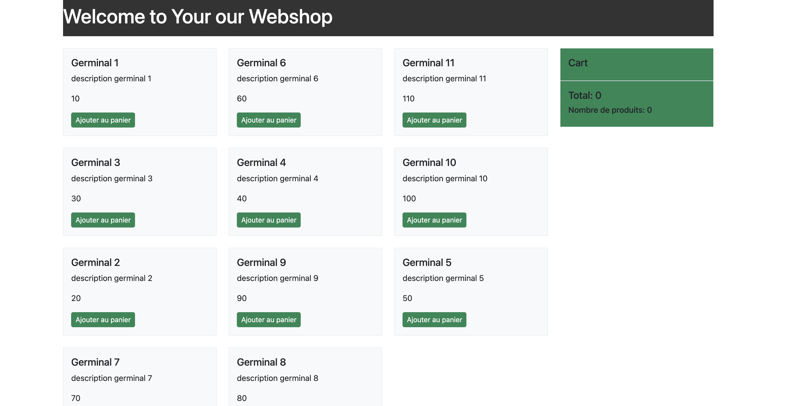

# WebShop
Il s'agit d'un projet sur les bases de VueJS NodeJs et MongoDB


dans ce projet on a utilisé les technologies suivantes :
- VueJS
- NodeJs
- MongoDB
- Express
- Axios
- Bootstrap

## Installation
```bash
npm install
``` 
Demarrer le serveur du backend
```bash
cd back


```bash
npm start
```
run the server on http://localhost:5000

Demarrer le serveur du frontend
```bash 
cd webshop
```
```bash 
npm run dev
```
Base de données se trouve dans le dossier
```bash
MongoDB
```
webshop
 
## Images du projet 



